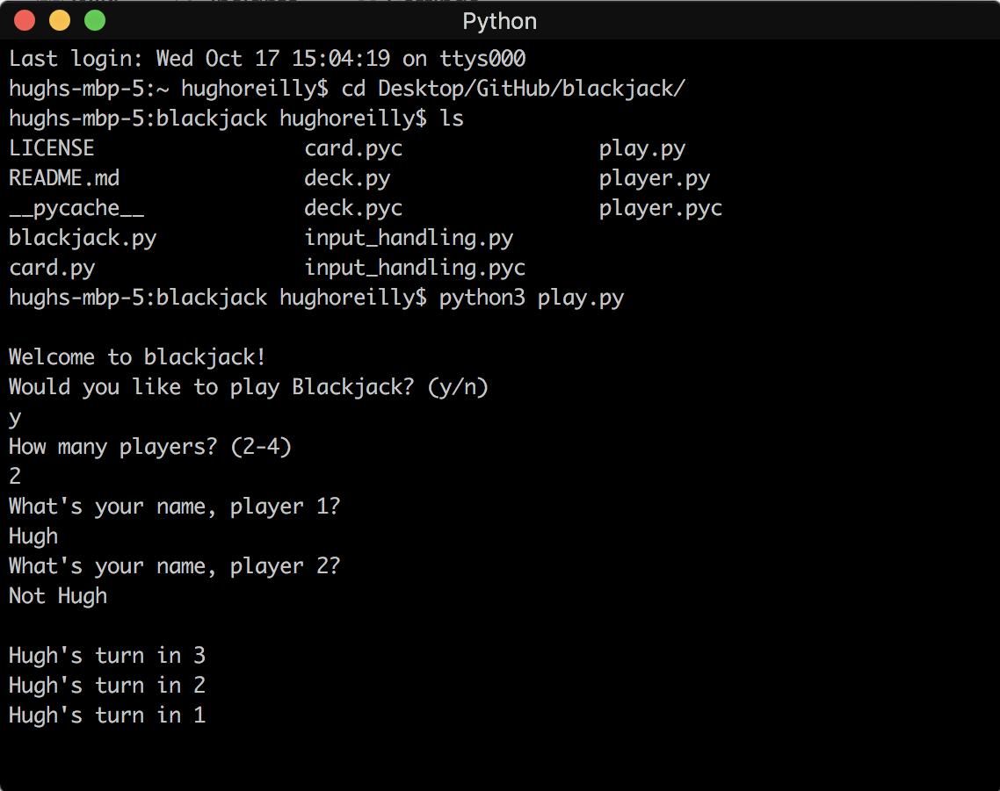

# blackjack
Rules: Get as close to 21 as you can without going over. The player with the highest number less than 22 wins.

## How to Play
This implementation of blackjack is meant to be played by multiple (2-4) people. At the start of the game, you will select the number of players and input their names. Then, cards will be drawn. Each player's cards will be displayed alone on the screen, with a 3 second grace period to pass the computer to the next player. After the cards have been initially displayed, players will have the option to draw a card or pass. At the end of the game, the winner will be displayed, and players will have the option of playing again.

## How to Run
- Make sure you have `python3` installed
- Clone the repository `git clone https://github.com/horeilly1101/blackjack`
- Navigate to the directory where the files are stored `cd blackjack`
- Execute `python3 play.py`
- Enjoy!