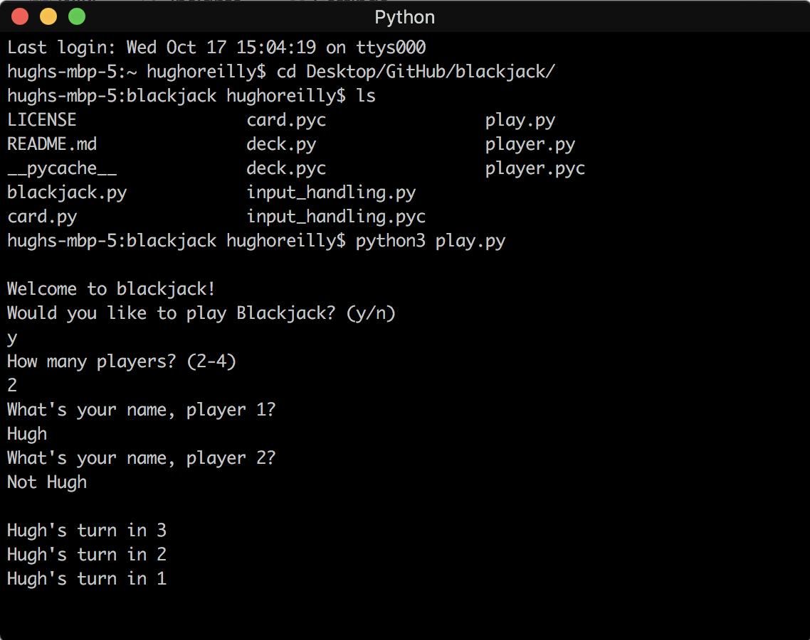

# blackjack
Rules: Get as close to 21 as you can without going over. The player with the highest number less than 22 wins.

## My implementation
- Allows 2 - 4 players
- Is entirely console-based
- Allows a 3-second "grace period" between turns for players to pass the computer amongst themselves
- Is pretty fun to play with friends

## How to run on mac OS
- Ensure that the latest version of Python 3 is installed
- Clone the repository `git clone https://github.com/horeilly1101/blackjack`
- Navigate to the directory where the files are stored `cd blackjack`
- run `python3 play.py`